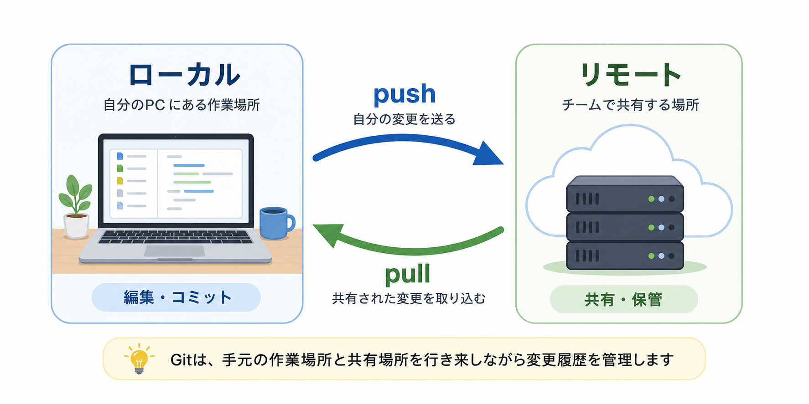

# Gitの全体像

Gitは、ファイルの **バージョン管理** をするための道具です。

バージョン管理とは、ファイルがどのように変わってきたのかを記録し、必要なときに過去の状態を確認したり、戻したりできるようにすることです。

たとえば、資料やコードを何度も修正していると、次のような状態になりがちです。

```txt
proposal.md
proposal_修正版.md
proposal_最終版.md
proposal_最終版2.md
proposal_本当の最終版.md
```

このような管理では、どれが正しい最新版なのか、どこを変えたのか、前の状態に戻せるのかが分かりにくくなります。

Gitを使うと、ファイル名を増やして管理するのではなく、変更の履歴として整理できます。

> まとめ: Gitは、ファイルの変更をバージョンとして記録し、必要なときに見返したり戻したりできるようにする道具です。

## バージョン管理でできること

Gitを使うと、次のようなことができます。

- ファイルの変更履歴を残す
- 変更内容の差分を確認する
- ある時点の状態をあとから見返す
- 必要なときに前の状態へ戻す
- チーム作業でも変更を共有しやすくする

Gitがあると、「どのファイルが今どう変わっているか」「この変更は何のためのものか」を確認しながら作業できます。これは、1人で作業するときにも、チームで作業するときにも役立ちます。

このレッスンでは全体像だけを押さえます。ブランチやレビューなどの詳しい仕組みは、後のレッスンで扱います。

製品やアプリでは、リリースした状態に次のようなバージョン番号を付けることがあります。

```txt
0.0.1  最初の試作品
0.1.0  機能を少し追加した版
1.0.0  チームで使える安定版
1.0.1  小さな修正を入れた版
```

この数字は、左から **メジャーバージョン**、**マイナーバージョン**、**パッチバージョン** と呼ばれます。

- メジャーバージョン: 大きな変更が入ったときに上がる
- マイナーバージョン: 機能追加など、中くらいの変更が入ったときに上がる
- パッチバージョン: 不具合修正や小さな調整で上がる

たとえば、`1.0.0` は安定して使える最初の版、`1.0.1` は小さな修正を入れた版、`1.1.0` は新しい機能を追加した版、というように状態を区別できます。

> Gitがすべての変更に `1.0.0` のような番号を自動で付けるわけではありません。Gitでは、変更のまとまりをコミットとして記録します。バージョン番号は、リリースや区切りを分かりやすくするために人が付けるラベルだと考えるとよいです。

## 前の状態に戻せる安心感

バージョン管理の大きなメリットは、必要なときに前の状態を確認したり、戻したりできることです。

たとえば、生成AIにコードや文章を大きく修正してもらったとします。修正量が多いと、一見よさそうに見えても、あとから「意図と違う方向に変わってしまった」と気づくことがあります。

このとき、Gitに変更前の記録が残っていれば、AIに直してもらう前の状態と、AI修正後の状態を比べられます。

```txt
変更前の記録      安定して動いていた状態
AI修正後の記録    生成AIで大きく修正した状態
```

もしAI修正後の内容が意図に合わなければ、変更前の記録を確認したり、必要に応じて戻したりできます。

Gitで変更前の状態を記録していれば、次のような対応ができます。

- AIによる修正前の内容を確認する
- どこが大きく変わったのか差分を見る
- 意図に合わない変更だけを取り除く
- 必要であれば前のバージョンに戻す

また、アプリや業務ツールで問題が起きたときにも、安定していた前の状態に戻す判断がしやすくなります。

このように、問題が起きたときに前の状態へ戻すことを **ロールバック** と呼ぶことがあります。

> ポイント: Gitは「間違えないための道具」ではなく、「変更しても確認・修正・復旧しやすくするための道具」です。

## リポジトリとは何か

では、その変更履歴はどこに保存されるのでしょうか。それがリポジトリです。

Gitで管理している作業場所を **リポジトリ** と呼びます。

リポジトリは、プロジェクトに関係するファイルと、その変更履歴をまとめて入れておく箱のようなものです。

たとえば、Webサイトを作っているなら、HTML、CSS、画像、READMEなどを1つの箱に入れて管理します。Gitを使うと、その箱の中身だけでなく、「いつ何を変えたか」という履歴も一緒に管理できます。

```txt
project/
  README.md
  index.html
  styles.css
```

この `project/` フォルダをGitで管理すると、フォルダ内に履歴を記録する場所が作られ、プロジェクト全体をリポジトリとして扱えるようになります。

ふつうのフォルダは、基本的に今入っているファイルだけを見る場所です。一方、リポジトリは、今のファイルに加えて、過去の変更履歴もたどれる場所です。

- フォルダ: 今のファイルを入れておく場所
- リポジトリ: 今のファイルと変更履歴をまとめて管理する場所

> リポジトリは、プロジェクトのファイル一式と、その変化の記録を入れておく箱だと考えると分かりやすいです。

## ローカルとリモート

Gitでは、リポジトリを置く場所が大きく2つあります。



- ローカルリポジトリ: 自分のPCにある作業場所
- リモートリポジトリ: GitHubなど、自分のPCの外にある共有・保管用の置き場所

自分のPCで作業した変更は、必要に応じてリモートリポジトリへ送ります。この操作を `push` と呼びます。

逆に、他の人がリモートリポジトリへ送った変更を、自分の作業ブランチへ取り込むこともあります。この操作を `pull` と呼びます。

最初は細かいコマンドを覚えるよりも、次の向きだけ押さえると理解しやすくなります。

- `push`: 自分のPCから共有場所へ送る
- `pull`: 共有場所から変更を取得し、自分の作業ブランチに取り込む

たとえば、次のような流れです。

```txt
自分のPCで修正する → pushで共有する → 他の人がpullで取り込む
```

## GitとGitHubの違い

GitとGitHubは同じものではありません。

ここでも、リポジトリを「ファイルと変更履歴を入れておく箱」と考えると違いが分かりやすくなります。

- Git: リポジトリという箱の中身と変更履歴を管理する道具
- GitHub: その箱をインターネット上に置き、チームで共有しやすくするサービス

Gitだけでも、自分のPCの中にリポジトリを作って履歴を管理できます。つまり、GitHubがなくてもGitは使えます。

ただし、チームで同じリポジトリを共有したり、Pull Requestでレビューしたりするには、GitHubのようなサービスを使うと便利です。

> ポイント: Gitは箱の中身と履歴を管理する道具、GitHubはその箱をチームで共有する置き場所です。
