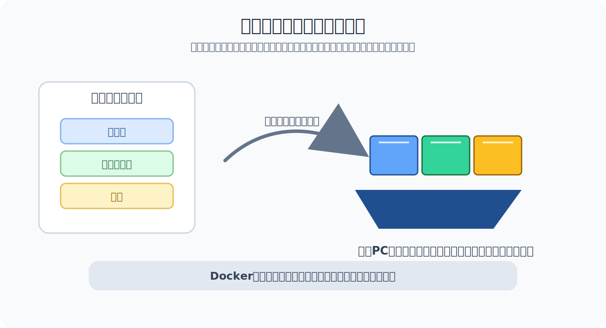

# Dockerって何？

Dockerを理解する前に、まず **コンテナ** という考え方を押さえると分かりやすくなります。

コンテナは、アプリケーションを動かすために必要なものを、ひとまとまりにした実行環境です。

```txt
アプリ
必要なライブラリ
実行に必要な設定
  ↓
コンテナとしてまとめる
```

船で荷物を運ぶコンテナをイメージすると分かりやすいです。中に何を入れるかを決めてコンテナにまとめておけば、別の船や港でも扱いやすくなります。

開発でも同じように、アプリ、ライブラリ、設定をコンテナとしてまとめることで、別のPCやサーバーでも同じように動かしやすくします。



> まとめ: コンテナは、アプリを動かすための環境をひとまとめにする考え方です。

## Dockerはコンテナを扱う技術

Dockerは、コンテナを作ったり、動かしたり、管理したりするための代表的な技術です。

つまり、Dockerそのものが目的ではありません。Dockerは、コンテナという考え方を実際に使いやすくするための道具です。

| 言葉 | 意味 |
| --- | --- |
| コンテナ | アプリを動かす環境をまとめる考え方 |
| Docker | コンテナを扱うための代表的な技術 |

初学者のうちは、まずこの関係を押さえると混乱しにくくなります。

## なぜコンテナを使うのか

チームで開発していると、次のような問題が起きます。

- 自分のPCでは動くが、他の人のPCでは動かない
- 必要なNode.jsやDBのバージョンが違う
- セットアップ手順が長く、環境構築に時間がかかる
- 本番環境とローカル環境で動きが違う

これは、PCやサーバーごとに環境が違うために起きます。

たとえば、同じプロジェクトでも、MacとWindowsで環境が違うと動かないことがあります。

| 環境 | 状態 | 結果 |
| --- | --- | --- |
| AさんのMac | Node.js 20 が入っている / 必要なコマンドが使える | アプリが動く |
| BさんのWindows | Node.js 18 が入っている / 一部のコマンドや設定が違う | 同じ手順なのにエラーになる |

また、OSによってパスの書き方や使えるコマンドが違うこともあります。

| OS | パスの例 |
| --- | --- |
| Mac / Linux | `/Users/user/project` |
| Windows | `C:\Users\user\project` |

このような違いが積み重なると、「READMEの通りにやったのに動かない」という状態になります。

コンテナを使うと、アプリを動かすために必要なものをまとめて扱えるため、環境差分を減らしやすくなります。

```txt
人によって環境が違う
  ↓
コンテナに必要なものをまとめる
  ↓
同じ環境を再現しやすくなる
```

> コンテナは「どの環境でも必ず完全に同じになる」魔法ではありませんが、環境差分を減らすための強力な手段です。

## イメージとコンテナ

Dockerでは、**イメージ** と **コンテナ** という言葉がよく出てきます。

イメージは、コンテナを作るための設計図のようなものです。

コンテナは、そのイメージから実際に起動した実行環境です。

ざっくり言うと、イメージはまだ動いていない設計図で、コンテナはその設計図から起動して動いているものです。

| 言葉 | 意味 |
| --- | --- |
| イメージ | コンテナを作る元になる設計図 |
| コンテナ | イメージから起動した実行中の環境 |

たとえるなら、イメージは弁当のレシピ、コンテナは実際に作られた弁当です。同じレシピから、同じような弁当を何度も作れます。

## Dockerfileとは

`Dockerfile` は、Dockerイメージの作り方を書くファイルです。

たとえば、次のようなことを書きます。

- どの実行環境をベースにするか
- どのファイルを入れるか
- どのコマンドを実行するか
- アプリをどう起動するか

```txt
Dockerfile
  ↓
Dockerイメージ
  ↓
コンテナとして起動
```

Dockerfileがあると、アプリを動かす環境の作り方をコードとして共有できます。

## docker composeとは

実際のWebアプリでは、1つのコンテナだけでなく、複数のコンテナを一緒に使うことがあります。

たとえば、Webアプリとデータベースを別々のコンテナで動かす構成です。

```txt
Webアプリのコンテナ
データベースのコンテナ
```

このような複数コンテナをまとめて起動するために、Docker Composeを使うことがあります。

```bash
docker compose up
```

このコマンドで、`compose.yaml` や `docker-compose.yml` に書かれたサービスをまとめて起動できます。

## 初学者が押さえると理解しやすい要素

Dockerを理解する上で、最初に押さえるとよい要素は次です。

| 要素 | まず押さえる意味 |
| --- | --- |
| コンテナ | アプリを動かす環境をひとまとめにする考え方 |
| Docker | コンテナを扱うための代表的な技術 |
| イメージ | コンテナを作る元になる設計図 |
| コンテナの起動 | イメージから実行環境を作って動かすこと |
| Dockerfile | イメージの作り方を書くファイル |
| Docker Compose | 複数のコンテナをまとめて扱う仕組み |
| 注意点 | 環境差分を減らせるが、すべての問題を自動で解決するわけではない |

## FDE人材が押さえること

Dockerを完全に書ける必要はなくても、次の点を押さえると実務で会話しやすくなります。

- Dockerはコンテナ技術を使いやすくする道具
- `docker compose up` で開発環境を起動することがある
- エラーが出たら、どのコンテナで起きているかを見る
- ローカル環境と本番環境の差分を減らすために使われることがある

> Dockerは、チームで同じ環境を再現しやすくするための土台として使われます。

## 理解度チェック

Q1. コンテナとDockerの関係として最も近いものはどれですか。

- A. コンテナはDockerfileそのものを保存するためのファイル
- B. コンテナは環境をまとめる考え方で、Dockerはそれを扱う代表的な技術
- C. Dockerはコンテナではなく、仮想マシンだけを作るための技術
- D. コンテナはDockerイメージを作るための設定ファイル

解説: Dockerはコンテナそのものではなく、コンテナを作成・実行・管理するための代表的な技術です。

Q2. Macでは動くのにWindowsでは動かない、という問題が起きる理由として最も近いものはどれですか。

- A. コンテナを使うとOSの違いが必ず完全に消えるため
- B. イメージとコンテナは常に同じ意味で使われるため
- C. Docker Composeを使うとNode.jsのバージョン確認が不要になるため
- D. OS、Node.jsのバージョン、パス、コマンドなどの環境差分があるため

解説: PCごとにOSやインストール済みソフト、パスの扱いなどが違うと、同じ手順でも動かないことがあります。

Q3. Dockerにおけるイメージの説明として最も近いものはどれですか。

- A. コンテナを作る元になる設計図
- B. 起動中のコンテナそのもの
- C. `docker compose up` で起動する複数サービスの設定ファイル
- D. ローカルPCとリモートサーバーの差分を自動で消す仕組み

解説: イメージはコンテナの元になる設計図のようなもので、そこからコンテナを起動します。

Q4. Dockerfileの役割として最も近いものはどれですか。

- A. 起動中のコンテナのログだけを保存する
- B. 複数のコンテナをまとめて起動するためのコマンドそのもの
- C. Dockerイメージの作り方を書く
- D. コンテナの中で必ずデータベースだけを動かすためのファイル

解説: Dockerfileには、どの環境をベースにするか、どのファイルを入れるか、どう起動するかなどを書きます。

Q5. Docker Composeを使う場面として最も近いものはどれですか。

- A. 1つのDockerイメージを手動で削除したいだけのとき
- B. Dockerfileにベースイメージだけを書きたいとき
- C. コンテナを使わずにOSへ直接Node.jsをインストールしたいとき
- D. Webアプリとデータベースなど、複数のコンテナをまとめて起動したいとき

解説: Docker Composeは、複数のコンテナをまとめて起動・管理したいときによく使われます。

答え:

- Q1: B
- Q2: D
- Q3: A
- Q4: C
- Q5: D
