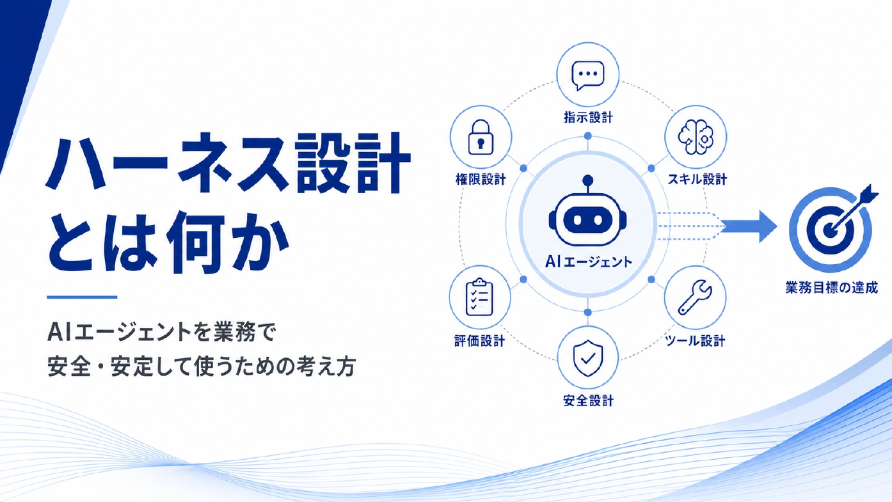
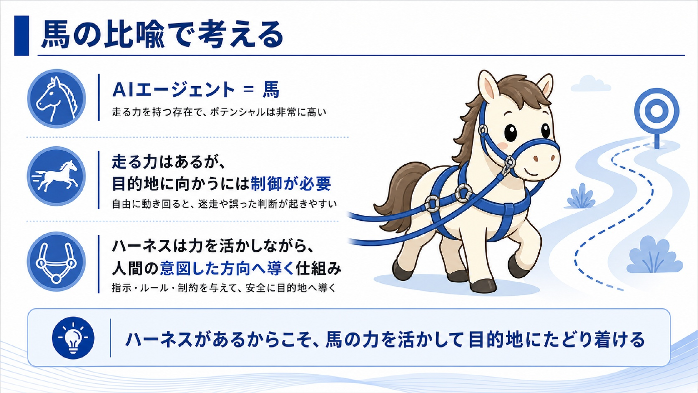
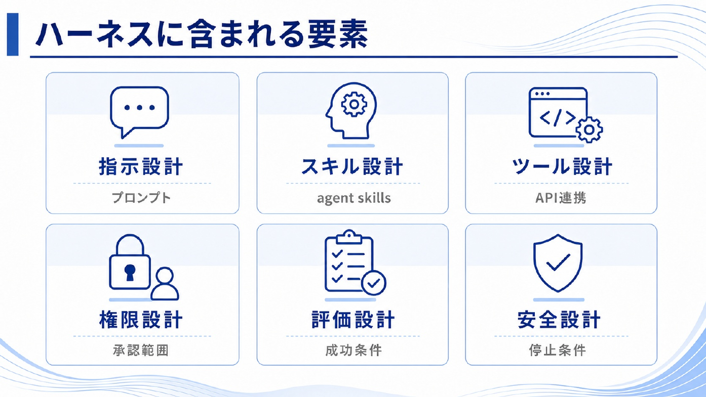
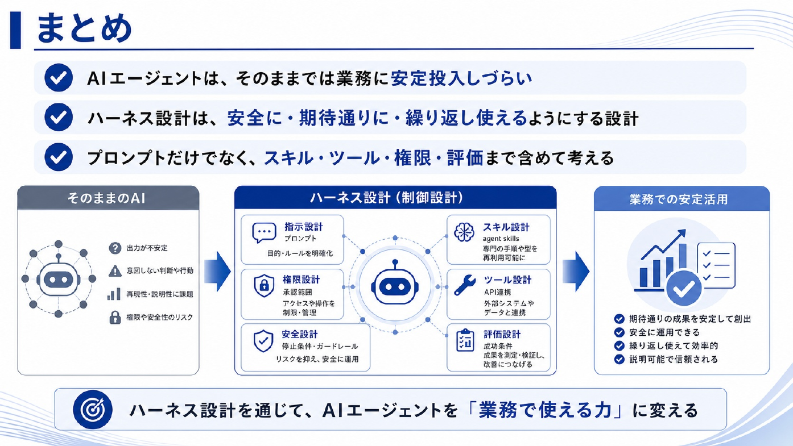

# ハーネス設計って何？

ハーネス設計とは、AIエージェントを業務で安全・安定して使うために、動き方を整える設計のことです。

AIエージェントは、指示を受けて考え、必要に応じてツールを使い、複数の手順を進められます。これは大きな強みですが、自由度が高いぶん、何も設計しないまま使うと結果がぶれたり、意図しない判断や操作につながったりします。

ハーネス設計は、その自由度をなくすためのものではありません。AIエージェントが持つ力を活かしながら、目的に沿って動けるようにするための考え方です。

## 馬の比喩で考える

AIエージェントは、走る力を持った馬のようなものです。

馬は力があり、速く走れます。しかし、何もつけずに自由に走らせるだけでは、目的地に向かうとは限りません。道を外れるかもしれませんし、途中で止まるかもしれませんし、乗り手の意図とは違う方向へ進むかもしれません。

そこで必要になるのがハーネスです。

ハーネスは、馬の力を押さえ込むためだけのものではありません。馬の力を活かしながら、人間が意図した方向へ安全に導くための仕組みです。

AIエージェントにおけるハーネス設計も同じです。AIの能力を制限するためだけではなく、業務の目的に沿って安定して力を発揮できるようにするために行います。

> まとめ: ハーネス設計は、AIエージェントを「自由に動く存在」から「業務で使える存在」に変えるための設計です。

## なぜハーネスが必要か

AIエージェントは、通常のチャットAIよりも自由度が高い存在です。

- 目的を解釈する
- 手順を考える
- ファイルやデータを読む
- ツールを使う
- 結果をもとに次の行動を決める

このように自律的に動ける範囲が広がるほど、設計の重要性も上がります。

指示が曖昧なままだと、AIはそれらしい答えを返せても、チームが期待する判断とはずれることがあります。使ってよい情報やツールの範囲が決まっていないと、必要以上に広い操作をしてしまう可能性もあります。成果の良し悪しを判断する基準がなければ、毎回の結果を安定して評価できません。

業務でAIエージェントを使うときは、便利さだけでなく、次のような観点が必要になります。

- 安全に使えること
- 同じ条件で、同じような結果を再現しやすいこと
- なぜその判断や出力になったのか説明しやすいこと
- 誰が、何を、どこまでできるのか管理できること

## ハーネスに含まれるもの

ハーネス設計は、プロンプトだけを整える話ではありません。

AIエージェントを業務で使うには、少なくとも次のような要素をまとめて考える必要があります。

| 要素 | 何を決めるか | 例 |
| --- | --- | --- |
| 指示設計 | 目的、前提、判断基準、出力形式 | 「何を達成したいか」「どんな形式で返すか」を明確にする |
| スキル設計 | 繰り返し使う手順や知識 | コンテンツ更新手順を `learning-content-harness` のようなスキルにする |
| ツール設計 | API、ファイル操作、検索などの手段 | どのコマンドや外部ツールを使ってよいかを決める |
| 権限設計 | 誰が、何を、どこまで実行できるか | ファイル編集は許可するが、削除や送信は確認を挟む |
| 評価設計 | 成功条件や確認方法 | `node scripts/validate-content.js` が通ることを確認する |
| 安全設計 | 止める条件、確認が必要な操作、扱ってはいけない情報 | 個人情報や秘密情報を外部に送らない |

これらは別々の話に見えますが、実際にはつながっています。

たとえば、AIに「資料を更新して」と依頼する場合、指示だけでは不十分です。どの資料を読むのか、どこまで編集してよいのか、更新後に何を確認するのか、失敗したときにどう止まるのかまで決めておく必要があります。

## チームで考える理由

ハーネス設計は、個人のプロンプト術だけではありません。

生成AIを推進するチームでは、うまくいった使い方を個人の経験で終わらせず、チームで再利用できる形にすることが重要です。

ある人だけがうまくAIを使える状態では、業務の品質は安定しません。別の人が同じ目的でAIを使ったときにも、近い考え方、近い手順、近い品質で進められるようにする必要があります。

そのために、ハーネス設計では「どう指示したか」だけでなく、「どんな前提で動かしたか」「何を使わせたか」「どこで人間が確認したか」「何を成功としたか」まで残していきます。

## まず押さえておきたいこと

ハーネス設計を考えるとき、最初から完璧な仕組みを作る必要はありません。

まずは次の問いを持つことが大切です。

- AIエージェントに達成してほしい目的は何か
- AIエージェントに任せてよい範囲はどこまでか
- 人間が確認すべき判断や操作はどこか
- 期待する成果はどう判断するか
- うまくいった手順をどう再利用できる形にするか

この問いを持っておくだけで、AIエージェントの使い方はかなり安定します。

## まとめ

ハーネス設計は、AIエージェントを業務で安全・安定して使うための制御設計です。

AIエージェントには高い自由度があります。その自由度をただ放置するのではなく、目的、指示、スキル、ツール、権限、評価、安全性を設計することで、業務で繰り返し使える力に変えていきます。

馬にハーネスをつけることで目的地へ導けるように、AIエージェントにもハーネスを設計することで、チームが意図した方向へ力を発揮できるようになります。

## 理解度チェック

Q1. ハーネス設計の説明として最も近いものはどれですか。

- A. AIの回答を長くするための文章テクニック
- B. AIエージェントを業務で安全・安定して使うために、動き方を整える設計
- C. AIを使わずに人間だけで作業するためのルール
- D. 画像生成AIだけに必要な設定

解説: ハーネス設計は、AIエージェントの自由度を活かしながら、業務の目的に沿って安全・安定して動けるようにするための設計です。

Q2. 馬の比喩で、ハーネスが表しているものはどれですか。

- A. AIエージェントの能力を完全に止めるもの
- B. AIエージェントの力を活かしながら、目的に沿って導く仕組み
- C. AIエージェントに任せる業務をなくすもの
- D. AIエージェントの見た目を整えるもの

解説: ハーネスは力を止めるものではなく、力を目的地へ向けるための仕組みです。AIエージェントでも同じ考え方をします。

Q3. ハーネス設計に含まれる要素として、本文で扱っていないものはどれですか。

- A. 指示設計
- B. 権限設計
- C. 評価設計
- D. 広告設計

解説: 本文では、指示設計・スキル設計・ツール設計・権限設計・評価設計・安全設計を扱っています。広告設計はこの文脈の要素ではありません。

Q4. 生成AIを推進するチームでハーネス設計を考える理由として、最も近いものはどれですか。

- A. うまくいった使い方を個人の経験で終わらせず、チームで再利用できる形にするため
- B. AIエージェントを完全に使わないようにするため
- C. すべての判断をAIに任せ、人間の確認をなくすため
- D. 毎回違うやり方で試すため

解説: チームで生成AIを推進するなら、個人だけがうまく使える状態ではなく、再利用できる手順や判断基準として残すことが重要です。

答え:

- Q1: B
- Q2: B
- Q3: D
- Q4: A
