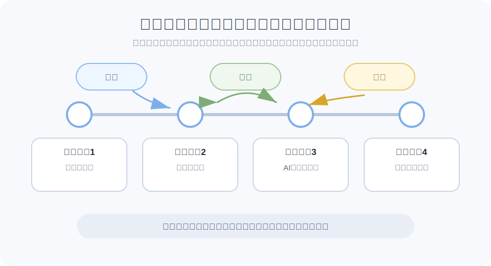
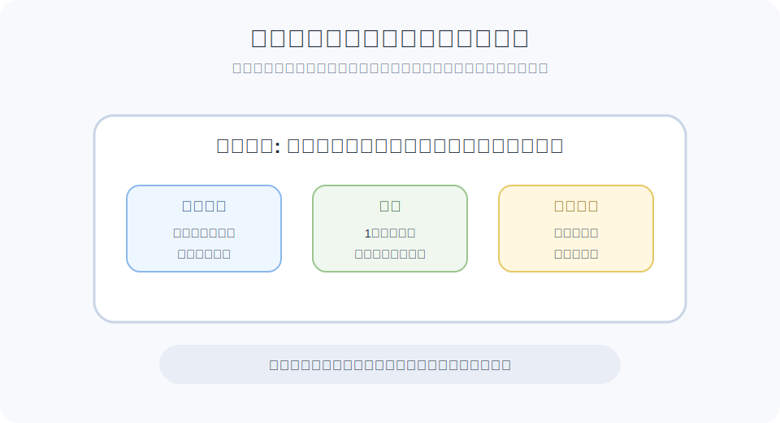

# コミットと変更履歴

コミットは、Gitに変更を記録する単位です。

前のレッスンでは、Gitはファイルのバージョン管理をする道具だと説明しました。そのバージョン管理の中心になるのがコミットです。

ファイルを編集しただけでは、まだGitの履歴には残りません。Gitでは、履歴に残したい変更を選び、それをコミットとして保存します。

実際の操作では、まず記録したい変更を選び、次にコミットします。具体的なコマンドは後の `add / commit` レッスンで扱います。

コミットは、ゲームでいうセーブポイントのようなものです。作業の区切りごとにコミットしておくと、「この時点ではどういう状態だったか」をあとから見返せます。

まずは、コミットが一本道に並んでいくイメージで考えると分かりやすいです。ブランチを使うと履歴が枝分かれすることもありますが、ここでは基本の流れだけ見ます。

このようにコミットが積み重なることで、Gitは変更履歴を管理できます。

> まとめ: コミットは、バージョン管理のために残す変更履歴のセーブポイントです。

## コミットすると何が起きるか

コミットすると、その時点で選んだ変更がGitの履歴に残ります。

たとえば、説明文を修正してコミットすると、「説明文を修正した状態」が履歴として保存されます。その後に別の変更をしても、前のコミットを見れば、説明文を修正した時点の内容を確認できます。

コミットがあるから、Gitはただのファイル置き場ではなく、変更の流れをたどれるバージョン管理の道具になります。

## コミットがあると何がうれしいか

バージョン管理では、「今の状態」だけでなく、「前はどうだったか」「どこで変わったか」を扱えることが重要です。

コミットを残しておくと、作業の状態を区切って見られます。横に並んだ点が、それぞれ作業の区切りとして残したコミットです。

もしコミット3のあとに「文章が意図と違う方向に変わってしまった」と気づいた場合、コミット2の状態を確認できます。どこが変わったのかを見比べたり、必要であれば過去の状態を参考にして直し方を考えられます。

また、コミット4で表示崩れを直したつもりなのに別の問題が起きた場合も、コミット3とコミット4の差分を見れば、どの変更が影響したのかを探しやすくなります。

コミットが積み重なって履歴になると、次のようなことができるようになります。

- いつから動かなくなったのかを調べる
- どの変更が影響したのかを確認する
- 変更理由をあとから確認する
- 必要に応じて過去の状態を参考にする

このように、コミットは単なる保存ではありません。あとから確認し、比較し、必要に応じて戻るための目印になります。

> ここでは考え方だけ押さえます。実際に戻す方法にはいくつかあり、状況によって使い分けます。

> コミットをこまめに残すほど、バージョン管理でたどれる道筋がはっきりします。

## よいコミットを作るには

よいコミットを作るときにまず意識したいのは、**1コミット1目的** と **分かりやすいメッセージ** です。

コミットには、その時点のファイル状態への参照、前のコミットとのつながり、作者や記録者、日時、コミットメッセージなどが含まれます。変更内容は、前のコミットとの差分として確認できます。

初心者のうちは、細かい仕組みよりも次の点を押さえると十分です。

- 前のコミットと比べて、どこが変わったかを確認できる
- 誰が変更を書き、誰がコミットとして記録したかが分かる
- コミットメッセージに書いた変更内容や理由が残る

この情報が残ることで、あとから「なぜこの変更が入ったのか」を追いやすくなります。

チームでは、あとから「この変更について誰に確認すればよいか」を探す手がかりにもなります。

よいコミットは、1つの目的にまとまっています。

- 誤字修正だけをまとめる
- ボタンの見た目変更だけをまとめる
- API呼び出しの修正だけをまとめる

逆に、関係のない変更が1つのコミットに混ざると、あとから読みにくくなります。

たとえば、「ログイン処理の修正」と「文章の誤字修正」と「デザイン調整」が1つのコミットに入っていると、レビューする人は何を確認すればよいか迷います。

- よい: ボタンの色変更だけをコミットする
- 分けたい: ボタンの色変更とログイン処理修正を同じコミットに入れる

そして、コミットには変更内容を説明するメッセージを付けます。コミットメッセージは、そのコミットという箱に貼るラベルのようなものです。

よいメッセージは、変更した事実だけでなく、何のための変更かが分かるものです。

- よい例: `ログイン失敗時のエラーメッセージを修正`
- よい例: `提案書の料金説明を最新条件に更新`
- 分かりにくい例: `修正`
- 分かりにくい例: `いろいろ変更`

> コミットは自分だけの作業メモではなく、チームに残す変更の説明です。

Gitを使う理由は、ただ保存するためではありません。チームで変更の流れを理解し、安心して改善を続けるために使います。
