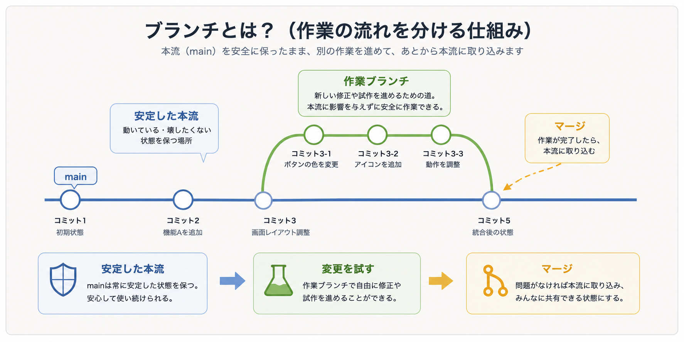

# ブランチとマージ

このレッスンでは、Gitで安全に作業を進めるために大事な **ブランチ** と **マージ** の考え方を学びます。

前のレッスンでは、コミットが変更履歴のセーブポイントになると説明しました。ブランチとマージが分かると、そのコミットの流れを分けたり、あとから1つにまとめたりするイメージがつかみやすくなります。

> まとめ: ブランチは、本流を壊さずに作業するための分かれ道です。

## ブランチとは何か

ブランチは、作業の流れを分けるための仕組みです。

Gitでは、コミットが順番に並んで変更履歴になります。ブランチは、そのコミットの流れに名前を付けて、途中から別の作業を進められるようにするものです。

たとえば、安定している状態を残したまま、新しい修正や試作を進めたいとします。そのときに、元の流れから作業用の道を分けるのがブランチです。



最初は、1本の道をイメージすると分かりやすいです。コミットが順番に並んでいる道があり、その途中から別の道を作って作業を進めます。

```txt
main:      コミット1 --- コミット2
                         \
作業用:                    コミット3 --- コミット4
```

この作業用の道がブランチです。

ブランチを使うと、まだ確認中の変更を本流から分けて扱えます。作業が終わり、問題ないと分かったら、本流に取り込みます。

## mainブランチ

多くのリポジトリでは、中心となるブランチに `main` という名前を使います。

`main` は、安定している状態を置く場所として扱われることが多いです。

- 動く状態を保つ
- チームで共有する基準にする
- 本番や公開状態の元にする

チーム開発では、`main` に直接変更を入れるのではなく、作業用ブランチで変更してから取り込む流れがよく使われます。

## 作業ブランチ

作業ブランチは、特定の修正や機能追加のために作るブランチです。

たとえば、ログイン画面を修正するなら、次のような名前のブランチを作ります。

```txt
fix-login-message
```

作業ブランチを使うと、まだ確認中の変更を `main` から分けて扱えます。

## マージとは何か

マージは、分かれていたブランチの変更を1つにまとめる操作です。

作業ブランチで修正した内容を確認し、問題なければ `main` に取り込みます。この取り込みがマージです。

```txt
main
  └─ 作業ブランチで修正
       └─ mainへマージ
```

マージによって、作業ブランチで作った変更が本流に反映されます。

## チーム作業でなぜ必要か

チームで同じリポジトリを扱うと、複数の人が同時に別々の変更を進めます。

もし全員が `main` に直接変更を入れると、まだ確認していない変更が本流に混ざったり、誰の作業がどこまで終わっているのか分かりにくくなったりします。

そこで、ブランチとマージを使います。

ブランチの役割は、作業を分けることです。

- 新しい機能を試す
- 文章や画面を修正する
- 不具合を直す
- AIに大きめの修正をさせて確認する

このような作業を `main` から分けて進めることで、確認中の変更が本流に直接混ざるのを防げます。

マージの役割は、確認済みの変更を本流へ戻すことです。

作業ブランチで変更し、内容を確認し、問題がないと判断できたら `main` に取り込みます。これにより、チームで共有する本流を安定させながら、必要な変更だけを反映できます。

```txt
作業を分ける: ブランチ
確認して戻す: マージ
```

> チーム作業では、ブランチで安全に試し、マージで確認済みの変更を共有する、という流れが基本になります。

## コンフリクト

コンフリクトは、同じ場所を複数の人が別々に変更したときに起きる衝突です。

たとえば、同じ文章の同じ行をAさんとBさんが別々に変更すると、Gitはどちらを採用すればよいか判断できません。

その場合は、人間が内容を確認して、どちらを残すか、またはどう組み合わせるかを決めます。

> コンフリクトは失敗ではありません。同じ場所に変更が重なったことをGitが知らせてくれている状態です。

## 理解度チェック

Q1. ブランチの説明として最も近いものはどれですか。

- A. GitHubの画面の色を変える設定
- B. 変更履歴の流れを分けて、別の作業を進められるようにする仕組み
- C. コミットメッセージを自動で翻訳する機能
- D. リポジトリを削除する操作

解説: ブランチは、コミットの流れを分けて、作業用の流れを作るための仕組みです。

Q2. `main` ブランチの役割として近いものはどれですか。

- A. 不要なファイルだけを集める場所
- B. 作業途中の変更を必ず直接入れる場所
- C. 安定している状態やチームで共有する基準として扱う場所
- D. Gitをインストールするためのコマンド

解説: `main` は、安定した本流やチームで共有する基準として扱われることが多いです。

Q3. マージの説明として最も近いものはどれですか。

- A. 分かれていたブランチの変更を1つにまとめる操作
- B. ファイル名をすべて英語に変える操作
- C. GitHubのアカウントを作る操作
- D. コミットを一切残さないようにする操作

解説: マージは、作業ブランチで進めた変更を `main` などの本流へ取り込む操作です。

Q4. チーム作業でブランチとマージを使う理由として最も近いものはどれですか。

- A. 全員が同じファイルを同時に直接編集できなくするためだけ
- B. Gitのコマンド数を減らすため
- C. レビューや確認を一切しなくてよくするため
- D. 作業を分けて安全に進め、確認済みの変更を本流へ戻すため

解説: ブランチで作業を分け、確認できた変更をマージすることで、チームの本流を安定させながら変更を共有できます。

答え:

- Q1: B
- Q2: C
- Q3: A
- Q4: D
