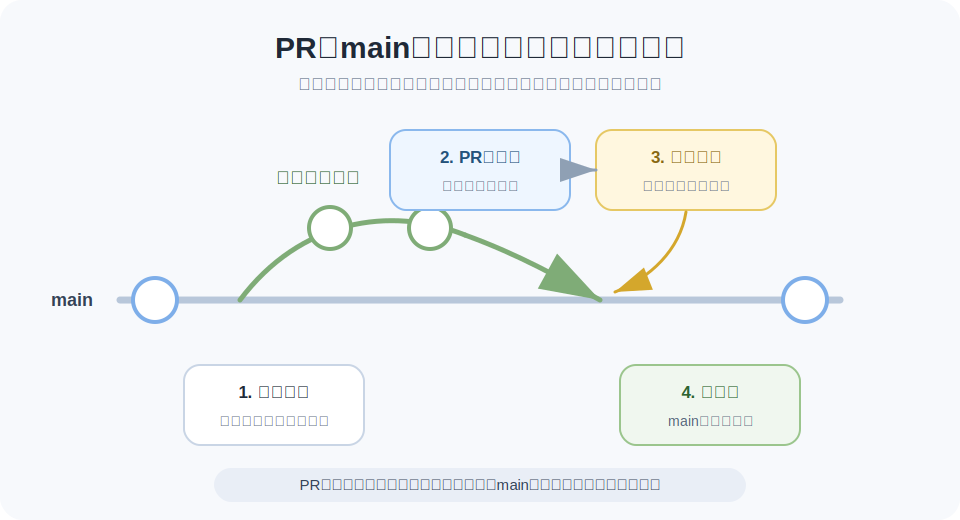

# Pull Requestとレビュー

前のレッスンでは、作業ブランチで変更し、問題がなければ `main` にマージする流れを説明しました。

チームで作業するときは、作業ブランチの変更をいきなり `main` にマージするのではなく、先に内容を確認してもらうことが多いです。その確認の場が **Pull Request** です。

Gitそのものの機能ではなく、GitHubなどのサービスで使われる仕組みです。略してPRと呼ばれることもあります。

> まとめ: Pull Requestは、「この変更を取り込んでよいか」を相談する場所です。

## ブランチからPull Requestへ

チーム作業では、次のような流れがよく使われます。

```txt
作業ブランチを作る
  ↓
作業ブランチで変更する
  ↓
Pull Requestを出す
  ↓
第三者がレビューする
  ↓
問題なければmainへマージする
```

それぞれの人が作業ブランチを切って作業すれば、`main` を安定した状態に保ちやすくなります。

そして、Pull Requestを出すことで、「この作業ブランチの変更を `main` に入れてよいか」をチームで確認できます。



> ポイント: PRは、作業ブランチと `main` をつなぐ前の確認ポイントです。

## Pull Requestで見るもの

Pull Requestでは、主に次の内容を確認します。

- どのファイルが変わったか
- どんな差分があるか
- 変更の目的は何か
- 動作確認やテストはされているか
- チームのルールに合っているか

Pull Requestがあると、変更を `main` に入れる前に、チームで内容を確認できます。

## レビューとは何か

レビューは、変更内容を他の人が確認することです。

レビューでは、単に間違いを探すだけではありません。次のような観点で確認します。

- 読みやすいか
- 目的に合っているか
- 影響範囲に問題がないか
- もっと分かりやすい方法がないか
- 必要な説明が書かれているか

レビューは、品質を上げるためだけでなく、チーム内で変更の背景を共有するためにも役立ちます。

## 差分を見る

Pull Requestで特に大事なのが差分です。

差分を見ると、変更前と変更後の違いが分かります。ファイル全体を読み直さなくても、どこが変わったのかを中心に確認できます。

GitやGitHubでは、追加された行、削除された行、変更された行を見ながらレビューできます。

## マージまでの流れ

基本的な流れは次の通りです。

- 作業ブランチで変更する
- 変更をリモートに送る
- Pull Requestを作る
- 差分を確認してもらう
- 必要があれば修正する
- 問題なければマージする

> Pull Requestは、作業を止めるための手続きではなく、変更を安全に共有するための確認ポイントです。

## 理解度チェック

Q1. Pull Requestの説明として最も近いものはどれですか。

- A. Gitをインストールするための画面
- B. リポジトリを削除する操作
- C. 作業ブランチの変更を `main` に取り込んでよいか相談・確認する場
- D. コミットメッセージを自動で生成する機能

解説: Pull Requestは、作業ブランチの変更を本流へ取り込む前に、チームで確認するための場です。

Q2. チーム作業でPRを出すタイミングとして近いものはどれですか。

- A. 作業ブランチで変更し、`main` に入れる前に確認してもらいたいとき
- B. パソコンの電源を切る直前
- C. GitHubのアカウントを消したいとき
- D. 画像ファイルだけを圧縮したいとき

解説: PRは、作業ブランチの変更を `main` にマージする前の確認ポイントとして使われます。

Q3. レビューで確認する観点として本文に近いものはどれですか。

- A. 変更した人のパソコンのメーカー
- B. ファイル名の文字数だけ
- C. 画面の明るさ
- D. 変更の目的、差分、影響範囲、必要な説明があるか

解説: レビューでは、単に間違いを探すだけでなく、目的に合っているか、影響範囲に問題がないかなどを確認します。

Q4. PRからマージまでの流れとして最も近いものはどれですか。

- A. `main` を削除してから作業する
- B. 作業ブランチで変更し、PRでレビューして、問題なければ `main` にマージする
- C. レビューせずに全員が直接 `main` を編集する
- D. コミットを一切残さずに共有する

解説: チームでは、作業ブランチで変更し、PRで確認してから `main` にマージする流れがよく使われます。

答え:

- Q1: C
- Q2: A
- Q3: D
- Q4: B
