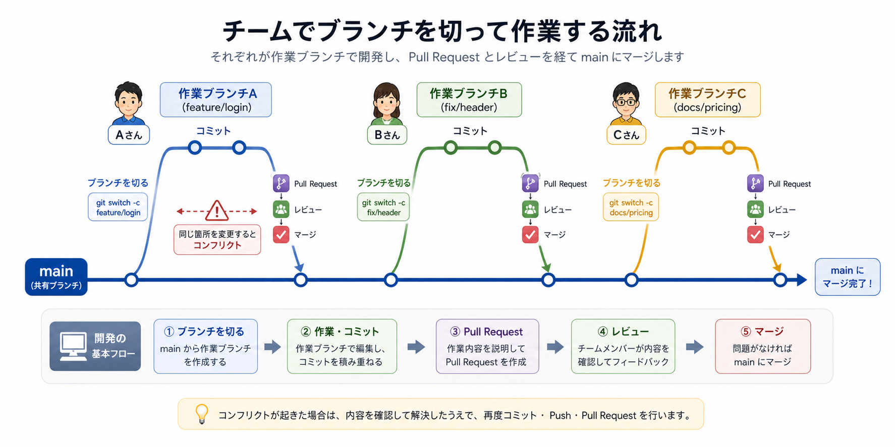

# 基本ワークフロー

Gitの基本ワークフローは、チームで同じリポジトリを編集するときの日常的な作業の流れです。

個別のコマンドを覚えるだけではなく、どの順番で使うのかを理解しておくと、実務で迷いにくくなります。

> まとめ: 初回は `clone`、日々の作業は `pull → branch → edit → status / diff → add → commit → push → PR` が基本の流れです。

## 1. 初回はリポジトリを取得する

チームのリポジトリで初めて作業するときは、まずリモートリポジトリを自分のPCに取得します。

この操作が `git clone` です。

```bash
git clone https://github.com/example/team-project.git
```

`clone` すると、GitHubなどにあるリモートリポジトリの内容が、自分のPCにローカルリポジトリとして作られます。

```txt
GitHubなどのリモート
  ↓ git clone
自分のPCのローカルリポジトリ
```

`git clone` は、基本的に最初の1回だけ行います。すでに自分のPCにリポジトリがある場合は、次回以降は `git pull` で最新状態を取り込みます。

## 2. 作業前に最新状態を取り込む

チームで作業していると、自分が作業していない間に、他の人の変更が `main` に入っていることがあります。

そのため、作業を始める前にリモートの最新状態を取り込みます。

```bash
git pull
```

また、対象を明示するなら次のように書けます。

```bash
git pull origin main
```

チームの変更を先に取り込んでおくと、古い状態のまま作業してしまうリスクを減らせます。

## 3. 作業用ブランチを作る

作業は、`main` に直接入れず、作業用ブランチで進めるのが基本です。

```bash
git switch -c update-login-message
```

同じことは、昔からよく使われている `checkout` でも書けます。

```bash
git checkout -b update-login-message
```

`switch` はブランチの切り替えや作成に分かりやすい新しめのコマンドです。一方で、実務では `checkout` を使った説明や記事も多く見かけます。

ブランチ名は、何の作業か分かる名前にします。

- `update-login-message`
- `fix-header-layout`
- `add-pricing-note`

チーム作業では、作業ブランチを分けることで、まだ確認中の変更を `main` に直接混ぜずに済みます。

## 4. ファイルを編集する

担当している修正内容に合わせて、必要なファイルを編集します。

この時点では、変更はまだGitの履歴には残っていません。

チームで作業するときは、担当外のファイルまで変更していないかを意識します。AIに修正を依頼した場合も、想定より広い範囲が変わることがあるため、あとで差分を確認します。

## 5. 状態と差分を確認する

変更したら、まず状態を確認します。

```bash
git status
```

中身の差分も確認します。

```bash
git diff
```

ここで、関係ない変更が混ざっていないかを確認します。

チームでレビューしてもらう前に、自分で差分を見る習慣をつけると、不要な変更や説明不足に気づきやすくなります。

## 6. 変更を記録する

記録したい変更を選びます。

```bash
git add README.md
```

そのあと、コミットとして保存します。

```bash
git commit -m "READMEの説明を更新"
```

コミットは、チームに残す変更の説明でもあります。1つの目的にまとまった単位でコミットすると、レビューする人も確認しやすくなります。

## 7. リモートへ送る

コミットした変更をリモートへ送ります。

```bash
git push
```

初めて作った作業ブランチを送るときは、環境によって追加の指定が必要になることがあります。

```bash
git push -u origin update-login-message
```

これは、ローカルの `update-login-message` ブランチを、`origin` というリモートへ送る操作です。

## 8. Pull Requestを作る

pushしたら、GitHubなどでPull Requestを作ります。

Pull Requestでは、変更内容を説明し、差分を確認してもらいます。レビューを受け、必要があれば追加で修正します。

レビューで指摘があった場合は、同じ作業ブランチで修正し、追加でコミットして、もう一度 `push` します。

```txt
レビュー指摘
  ↓
同じ作業ブランチで修正
  ↓
追加コミット
  ↓
git push
```

問題がなければ、Pull Requestを通じて `main` にマージします。

## コンフリクトが起きた場合

チームで同じリポジトリを編集していると、コンフリクトが起きることがあります。

コンフリクトは、複数の人が同じファイルの同じ場所を別々に変更し、Gitがどちらを採用すればよいか判断できない状態です。

たとえば、Aさんが見出しの文章を変更し、Bさんも同じ見出しを別の文章に変更した場合、Gitは自動では1つに決められません。

```txt
Aさんの変更: ログイン画面の説明を修正
Bさんの変更: 同じ説明文を別の内容に修正
```

このような場合は、人が内容を確認して、どちらを残すか、または両方を組み合わせるかを決めます。

基本的な対応の流れは次の通りです。

```txt
コンフリクトが発生
  ↓
対象ファイルを開いて内容を確認
  ↓
残す内容に編集する
  ↓
git add で解決済みとしてステージング
  ↓
commit または merge / rebase を続行
```

コンフリクトが起きたら、まず `git status` を確認します。

```bash
git status
```

Gitは、どのファイルでコンフリクトが起きているかを表示してくれます。

対象ファイルには、次のような目印が入ることがあります。

```txt
<<<<<<< HEAD
自分の変更
=======
相手側の変更
>>>>>>> main
```

この目印を見ながら、最終的に残したい内容へ編集します。編集が終わったら、目印も消します。

その後、解決したファイルをステージングします。

```bash
git add README.md
```

コンフリクト対応では、どちらかを機械的に選ぶのではなく、「チームとして最終的にどういう内容にしたいか」を確認することが大切です。迷う場合は、変更した人やレビュー担当者に確認します。

> コンフリクトは失敗ではありません。同じ場所に変更が重なったことをGitが知らせてくれている状態です。

## チーム作業の一連の流れ

チームで既存リポジトリを編集する場合、全体像は次のようになります。



```txt
初回だけ:
git clone

日々の作業:
git pull
git switch -c 作業ブランチ
または git checkout -b 作業ブランチ
ファイルを編集
git status
git diff
git add
git commit
git push
Pull Request
レビュー
必要ならコンフリクト対応
mainへマージ
```

## 困ったらまず見るもの

Gitで迷ったときは、まず次のコマンドを確認します。

```bash
git status
```

`git status` は、今どのブランチにいて、どのファイルがどういう状態かを教えてくれます。

チーム作業では、次の点も確認します。

- 今いるブランチは作業用ブランチか
- 変更したファイルは意図したものだけか
- コミット前に差分を確認したか
- push後にPull Requestを作ったか

> Gitの基本は、今の状態を確認しながら小さく進めることです。

## 理解度チェック

Q1. チームのリポジトリで初めて作業するときに使うコマンドとして最も近いものはどれですか。

- A. `git push`
- B. `git clone`
- C. `git status`
- D. `git diff`

解説: 初めて作業するときは、リモートリポジトリを自分のPCに取得するために `git clone` を使います。

Q2. 作業用ブランチを作る理由として最も近いものはどれですか。

- A. まだ確認中の変更を `main` に直接混ぜずに進めるため
- B. GitHubのアカウントを作るため
- C. コミットメッセージを自動生成するため
- D. すべての変更を削除するため

解説: チーム作業では、作業ブランチを分けることで、確認中の変更を `main` から分けて扱えます。

Q3. Pull Requestでレビュー指摘があった場合の流れとして最も近いものはどれですか。

- A. リポジトリを削除して最初から作り直す
- B. `main` に直接修正を入れて終わる
- C. 同じ作業ブランチで修正し、追加コミットして、もう一度 `push` する
- D. `git clone` を毎回やり直す

解説: レビュー指摘があった場合は、同じ作業ブランチで修正し、追加コミットして再度 `push` します。

Q4. コンフリクトが起きたときの考え方として最も近いものはどれですか。

- A. Gitが壊れたので必ずリポジトリを作り直す
- B. コミットメッセージが短すぎる状態
- C. すべての変更が自動で正しくマージされた状態
- D. 同じ場所の変更が重なり、Gitが自動で選べない状態なので、人が内容を確認して解決する

解説: コンフリクトは失敗ではなく、同じ場所への変更が重なったことをGitが知らせている状態です。

答え:

- Q1: B
- Q2: A
- Q3: C
- Q4: D
