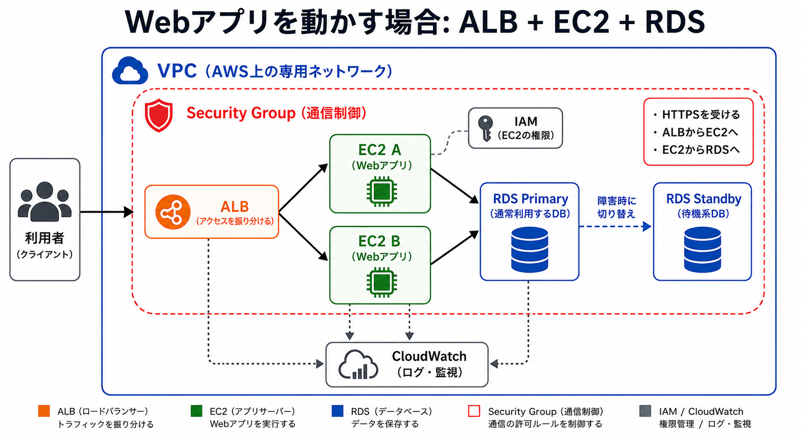
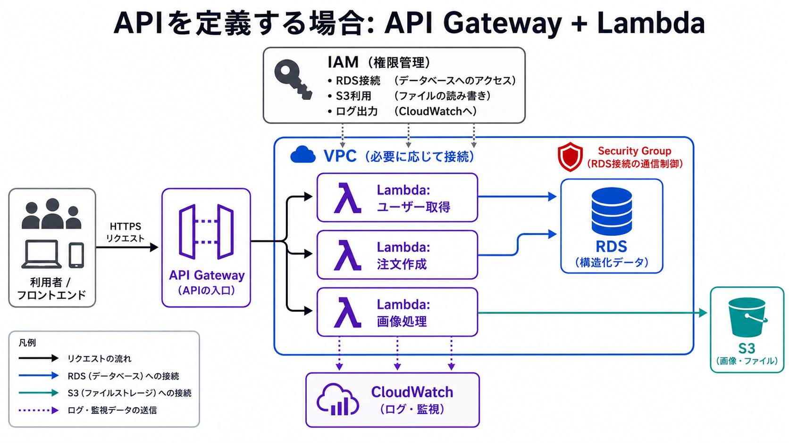

# AWSで見るインフラ構成の例

ここまで、ドメイン、IPアドレス、HTTP、DB、ストレージ、クラウドについて見てきました。

このレッスンでは、AWSのサービス名を例にして、クラウド上のインフラ構成を具体的に整理します。

AWSサービス名を暗記することが目的ではありません。大切なのは、用途によって構成が変わることと、それぞれの部品がどの役割を担当しているかを理解することです。

> まとめ: AWS構成は1つではありません。Webアプリを動かす構成と、APIを定義して処理を動かす構成では、入口や実行場所が変わります。

## まず全体の役割を押さえる

クラウド構成では、次の役割を分けて考えると理解しやすくなります。

| 役割 | AWSリソースの例 | 何をするか |
| --- | --- | --- |
| ネットワーク | VPC | AWS上の専用ネットワークを作る |
| Webの入口 | ALB | アクセスをアプリへ振り分ける |
| APIの入口 | API Gateway | APIリクエストを受ける |
| アプリ実行 | EC2 | 仮想サーバー上でアプリを動かす |
| 処理実行 | Lambda | 関数単位で処理を実行する |
| DB | RDS | 構造化データを保存する |
| ファイル保存 | S3 | 画像やPDFなどを保存する |
| 権限 | IAM | 誰が何をできるかを管理する |
| 通信制御 | Security Group | インバウンド / アウトバウンドを制御する |
| 監視 | CloudWatch | ログやメトリクスを見る |

このあと、用途別に2つの構成を見ます。

## Webアプリを動かす場合: ALB + EC2 + RDS

常に動くWebアプリをサーバー上で動かす場合、ALB、EC2、RDSを使う構成が考えられます。



大まかな流れは次の通りです。

```txt
利用者
  ↓
ALB
  ├→ EC2 A
  └→ EC2 B
       ↓
RDS Primary / Standby
```

ALBは、利用者からのアクセスを複数のEC2へ振り分けます。

EC2は、WebアプリやAPIサーバーを動かす仮想サーバーです。複数台にすることで、1台に負荷が集中しにくくなります。

RDSは、ユーザー情報や注文情報などの構造化データを保存するDBです。Primary / Standbyのような構成にすると、障害時に待機系へ切り替えやすくなります。

| リソース | 役割 |
| --- | --- |
| ALB | 利用者からのアクセスを複数のEC2へ振り分ける |
| EC2 | WebアプリやAPIサーバーを動かす |
| RDS Primary | 通常利用するDB |
| RDS Standby | 障害時に備える待機系DB |

この構成は、サーバー上でアプリを常に動かすイメージを持つと分かりやすいです。

## Webアプリ構成を支える要素

Webアプリ構成では、Security Group、IAM、CloudWatchも重要です。

| 要素 | この構成での見方 |
| --- | --- |
| Security Group | ALB、EC2、RDSの通信を制御する |
| IAM | EC2がS3やCloudWatchなどを使う権限を管理する |
| CloudWatch | ALBやEC2のログ、メトリクスを見る |

Security Groupでは、たとえば次のように通信を絞ります。

```txt
利用者 → ALB: HTTPSを許可
ALB → EC2: ALBからの通信だけ許可
EC2 → RDS: EC2からのDB接続だけ許可
外部 → RDS: 許可しない
```

このように、どこからどこへの通信を許可するかを決めることで、不要なアクセスを減らします。

## APIを定義する場合: API Gateway + Lambda

APIの入口を作り、処理を関数単位で動かす場合、API GatewayとLambdaを使う構成が考えられます。



大まかな流れは次の通りです。

```txt
利用者 / フロントエンド
  ↓
API Gateway
  ├→ Lambda: ユーザー取得
  ├→ Lambda: 注文作成
  └→ Lambda: 画像処理
        ↓
RDS / S3
```

API Gatewayは、APIリクエストの入口です。

Lambdaは、関数単位で処理を実行する仕組みです。たとえば、ユーザー取得、注文作成、画像処理のように、処理ごとに関数を分けて考えられます。

RDSには構造化データを保存し、S3には画像やファイルを保存します。

| リソース | 役割 |
| --- | --- |
| API Gateway | APIリクエストを受ける入口 |
| Lambda | 関数単位で処理を実行する |
| RDS | ユーザー情報や注文情報などを保存する |
| S3 | 画像やPDFなどのファイルを保存する |

この構成は、サーバーを直接管理するよりも、APIごとの処理を小さく分けて動かすイメージに近いです。

## API構成を支える要素

API Gateway + Lambda構成では、IAMが特に重要です。

LambdaがRDSやS3、CloudWatchを使うには、適切な権限が必要です。

| 要素 | この構成での見方 |
| --- | --- |
| IAM | LambdaがRDS、S3、CloudWatchを使う権限を管理する |
| Security Group | LambdaがVPC内のRDSへ接続する場合の通信を制御する |
| CloudWatch | Lambdaのログやエラーを見る |

たとえば、LambdaがS3から画像を読む場合、LambdaにS3を読む権限が必要です。

```txt
Lambda
  ↓ IAMで許可されている場合
S3の画像を読む
```

権限が足りないと、コードが正しくてもS3やRDSへアクセスできないことがあります。

## どちらを使うか

どちらの構成が正解というより、用途によって向き不向きがあります。

| 用途 | 向いている構成 |
| --- | --- |
| 常に動くWebアプリをサーバー上で運用したい | ALB + EC2 + RDS |
| 複数台のサーバーにアクセスを振り分けたい | ALB + EC2 + RDS |
| APIごとに処理を小さく分けたい | API Gateway + Lambda |
| サーバーを直接管理せずに処理を動かしたい | API Gateway + Lambda |

実際のシステムでは、EC2構成とLambda構成を組み合わせることもあります。

たとえば、Webアプリ本体はEC2で動かし、一部の画像処理や通知処理だけLambdaに任せる、といった構成もあります。

## まず押さえること

最初に押さえるべきことは次の5つです。

- Webアプリを常時動かす構成では、ALB、EC2、RDSがよく出てくる
- APIを定義する構成では、API Gateway、Lambda、RDS、S3がよく出てくる
- Security Groupは通信制御、IAMは権限管理
- CloudWatchはログや監視を見る場所
- AWS構成は1つではなく、用途に合わせて組み合わせる

> AWSのサービス名を覚えるよりも、用途ごとにどの部品がどの役割を持つかを押さえることが大切です。

## 理解度チェック

Q1. Webアプリを複数のEC2で動かし、アクセスを振り分けたい場合に使う入口として最も近いものはどれですか。

- A. S3
- B. ALB
- C. IAM
- D. CloudWatch

解説: ALBは、利用者からのアクセスを複数のEC2へ振り分けるロードバランサーとして使われます。

Q2. API Gateway + Lambda構成の説明として最も近いものはどれですか。

- A. API GatewayがAPIの入口になり、Lambdaが関数単位で処理を実行する
- B. API GatewayがDBの待機系になり、LambdaがDNSを購入する
- C. API Gatewayが画像ファイルだけを保存し、LambdaがGitのブランチを作る
- D. API GatewayがSecurity Groupの代わりに通信制御だけを行う

解説: API GatewayはAPIリクエストの入口になり、Lambdaはその裏側で処理を実行します。

Q3. Security Groupの見方として最も近いものはどれですか。

- A. 誰がAWSリソースを操作できるかを管理する
- B. Lambdaのログだけを保存する
- C. インバウンド / アウトバウンドの通信を制御する
- D. DBのPrimary / Standbyを必ず作る

解説: Security Groupは、どこからどこへの通信を許可するかを制御する仕組みです。

Q4. IAMの見方として最も近いものはどれですか。

- A. EC2の台数を自動で必ず増やす
- B. HTTPステータスコードをすべて200にする
- C. RDSのデータを画像ファイルに変換する
- D. 誰が何をできるか、どのサービスが何にアクセスできるかを管理する

解説: IAMは、ユーザーやAWSサービスに対して、どのリソースへ何ができるかを管理する権限の仕組みです。

Q5. CloudWatchを見る場面として最も近いものはどれですか。

- A. Gitのコミットメッセージを翻訳したいとき
- B. ドメイン名を新しく購入したいとき
- C. LambdaやEC2のログ、エラー、メトリクスを確認したいとき
- D. `node_modules/` をGitに入れたいとき

解説: CloudWatchは、ログ、メトリクス、アラートなどを確認し、問題調査や監視に使われます。

答え:

- Q1: B
- Q2: A
- Q3: C
- Q4: D
- Q5: C
