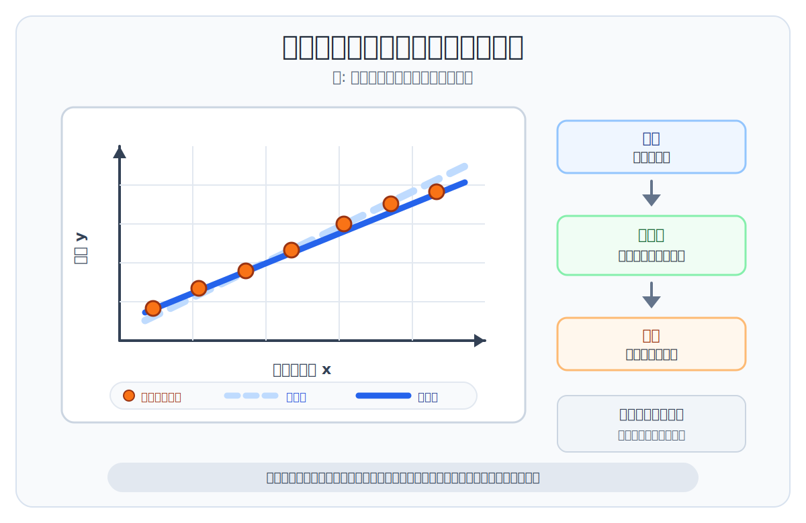

# 機械学習とは何か

機械学習は、データからパターンを学び、予測や分類に使う技術です。

人間がすべてのルールを細かく書くのではなく、データをもとにAIが傾向を学びます。

```txt
データ
  ↓ 学習
モデル
  ↓
予測・分類・生成
```

> まとめ: 機械学習は、データからパターンを学んで判断に使う技術です。

## ルールベースとの違い

昔からあるプログラムでは、人間がルールを書きます。

```txt
もし条件Aなら、処理Bをする
```

機械学習では、大量のデータからパターンを学びます。

| 考え方 | 何をするか |
| --- | --- |
| ルールベース | 人間が条件やルールを書く |
| 機械学習 | データからパターンを学ぶ |

たとえば、迷惑メール判定では、人間がすべての条件を書くのではなく、過去のメールデータから迷惑メールらしさを学習します。

## 関数近似として見る

機械学習は、少し数学っぽく言うと **関数近似** をしていると考えられます。

関数近似とは、入力と出力の関係をうまく表す関数を、データから近づけていくことです。

```txt
入力 x
  ↓
モデル f(x)
  ↓
予測 y
```

たとえば、部屋の広さから家賃を予測したい場合を考えます。

| 入力 x | 出力 y |
| --- | --- |
| 部屋の広さ | 家賃 |

部屋が広くなると、家賃もある程度高くなりやすいです。

もちろん現実には、広さだけで家賃が決まるわけではありません。立地、築年数、駅からの距離、階数、設備なども関係します。

ただ、まずは簡単にするために「部屋の広さ」という1つの入力から「家賃」という出力を予測する例で考えます。

機械学習では、たくさんの部屋データを見ながら「この広さなら、このくらいの家賃になりそう」という関係を表すモデルを作ります。



図の点が実際のデータです。最初はデータに合っていない線でも、学習を通じて点の並びに近づくように調整していきます。

初学者のうちは、機械学習を「データに合う関数を探すこと」と考えると理解しやすくなります。

## 実際には複数のパラメータを調整する

上の図では、分かりやすくするために「部屋の広さ」と「家賃」の関係を一次関数のように描いています。

実際の機械学習では、入力は1つとは限りません。

| 入力の例 | 家賃予測での意味 |
| --- | --- |
| 部屋の広さ | 広いほど家賃が上がりやすい |
| 駅からの距離 | 近いほど家賃が上がりやすい |
| 築年数 | 新しいほど家賃が上がりやすい |
| 立地 | 人気エリアほど家賃が上がりやすい |
| 設備 | オートロックや宅配ボックスなどが影響する |

モデルは、これらの入力に対して「どの要素をどれくらい重視するか」というパラメータを持ちます。

学習では、予測した家賃と実際の家賃の差を見て、その差が小さくなる方向へパラメータを少しずつ調整します。

このとき、誤差がどちらに変化するかを調べる考え方として、微分が使われます。

```txt
予測する
  ↓
実際の値と比べて誤差を見る
  ↓
誤差が小さくなる方向を調べる
  ↓
パラメータを少し調整する
  ↓
これを何度も繰り返す
```

初学者の段階では、細かい計算式よりも「予測と正解の差を見ながら、モデルのパラメータを少しずつよくする」と押さえれば十分です。

## モデルとは

モデルは、データから学習した結果を使って、入力に対する出力を返すものです。

たとえば、次のように使います。

```txt
入力: 部屋の広さ、駅からの距離、築年数など
  ↓
モデル
  ↓
出力: 予測される家賃
```

生成AIで使われるLLMや画像生成モデルも、広い意味では機械学習モデルの一種です。

## 教師あり学習と強化学習

関数近似の進め方には、いくつかの種類があります。

ここでは代表的なものとして、教師あり学習と強化学習を押さえます。

実際には教師なし学習など他の学習方法もありますが、まずは「正解を使って近づける」「報酬を使って近づける」という2つの見方を理解すると全体像をつかみやすくなります。

| 種類 | 何を使って学ぶか | イメージ |
| --- | --- | --- |
| 教師あり学習 | 入力と正解のペア | 正解に近い出力を出せるように学ぶ |
| 強化学習 | 行動に対する報酬 | よい結果につながる行動を増やすように学ぶ |

教師あり学習では、入力と正解の組み合わせを使います。

```txt
入力: 部屋の広さ、駅からの距離、築年数など
正解: 実際の家賃
  ↓
この関係に近づくようにモデルを調整する
```

強化学習では、最初から正解データがすべて用意されているというより、行動の結果として得られる報酬をもとに学習します。

```txt
行動する
  ↓
結果を見る
  ↓
報酬が高い行動を取りやすくする
```

どちらも見方を変えると、「入力に対して、よりよい出力や行動を返す関数に近づける」ための学習方法です。

## 学習と推論

機械学習では、学習と推論を分けて考えると分かりやすいです。

| 言葉 | 意味 |
| --- | --- |
| 学習 | データからパターンを覚える |
| 推論 | 学習済みモデルを使って結果を出す |

たとえば、過去のデータでモデルを学習し、その後、新しい入力に対して予測を行います。

```txt
過去データで学習
  ↓
学習済みモデル
  ↓
新しい入力に対して推論
```

## 生成AIとの関係

生成AIは、機械学習の発展の上にあります。

大量の文章、画像、コードなどからパターンを学び、入力に応じて新しい出力を生成します。

| 技術 | ざっくりした役割 |
| --- | --- |
| 機械学習 | データからパターンを学ぶ |
| 深層学習 | 多層のニューラルネットワークで複雑なパターンを学ぶ |
| 生成AI | 学習したパターンをもとに新しい出力を作る |

まずは、生成AIも「データから学習したモデルを使って出力している」と押さえると理解しやすくなります。

## まず押さえること

- 機械学習は、データからパターンを学ぶ技術
- 関数近似とは、入力と出力の関係をデータから近づけること
- モデルは、学習したパターンを使って結果を返す
- 教師あり学習は正解データ、強化学習は報酬を使って学ぶ
- 学習はパターンを覚えること、推論は結果を出すこと
- 生成AIは機械学習の発展の上にある

> 機械学習を理解すると、生成AIが「魔法」ではなく、データとモデルにもとづく仕組みだと捉えやすくなります。

## 理解度チェック

Q1. 機械学習の説明として最も近いものはどれですか。

- A. 人間がすべてのルールを手書きすることだけを指す
- B. データからパターンを学び、予測や分類に使う技術
- C. GitHubのIssueを閉じる機能
- D. DNSレコードを自動で削除する仕組み

解説: 機械学習は、データからパターンを学び、新しい入力に対する予測や分類などに使います。

Q2. 推論の説明として最も近いものはどれですか。

- A. 学習済みモデルを使って、新しい入力に対する結果を出すこと
- B. DBのテーブル名を変更すること
- C. 画像ファイルをS3に保存すること
- D. npmパッケージを削除すること

解説: 推論は、学習済みモデルを使って結果を出す段階です。

Q3. モデルの説明として最も近いものはどれですか。

- A. データから学習したパターンを使って出力を返すもの
- B. HTTPの標準ポート番号
- C. Gitのリモートリポジトリ
- D. CloudWatchのログ保存先だけを指す言葉

解説: モデルは、学習したパターンをもとに入力に対する出力を返します。

Q4. 関数近似の説明として最も近いものはどれですか。

- A. Gitのコミット履歴を削除すること
- B. 入力と出力の関係を表す関数を、データに近づけていくこと
- C. DNSでドメイン名をIPアドレスに変換すること
- D. 画像ファイルをS3へ保存すること

解説: 関数近似は、データをもとに入力から出力への関係をうまく表す関数へ近づける考え方です。

Q5. 教師あり学習と強化学習の違いとして最も近いものはどれですか。

- A. 教師あり学習はAIと関係なく、強化学習だけが機械学習である
- B. 教師あり学習は画像だけ、強化学習は文章だけを扱う
- C. 教師あり学習は入力と正解のペア、強化学習は報酬をもとに学ぶ
- D. 教師あり学習も強化学習も、データや結果を使わずに動く

解説: 教師あり学習は正解データを使い、強化学習は行動の結果として得られる報酬を使って学びます。

Q6. 生成AIと機械学習の関係として最も近いものはどれですか。

- A. 生成AIは機械学習とまったく関係しない
- B. 生成AIはデータを使わずに動く
- C. 機械学習は画像保存だけの技術である
- D. 生成AIは機械学習の発展の上にある

解説: 生成AIは、データからパターンを学ぶ機械学習の考え方の上に成り立っています。

答え:

- Q1: B
- Q2: A
- Q3: A
- Q4: B
- Q5: C
- Q6: D
